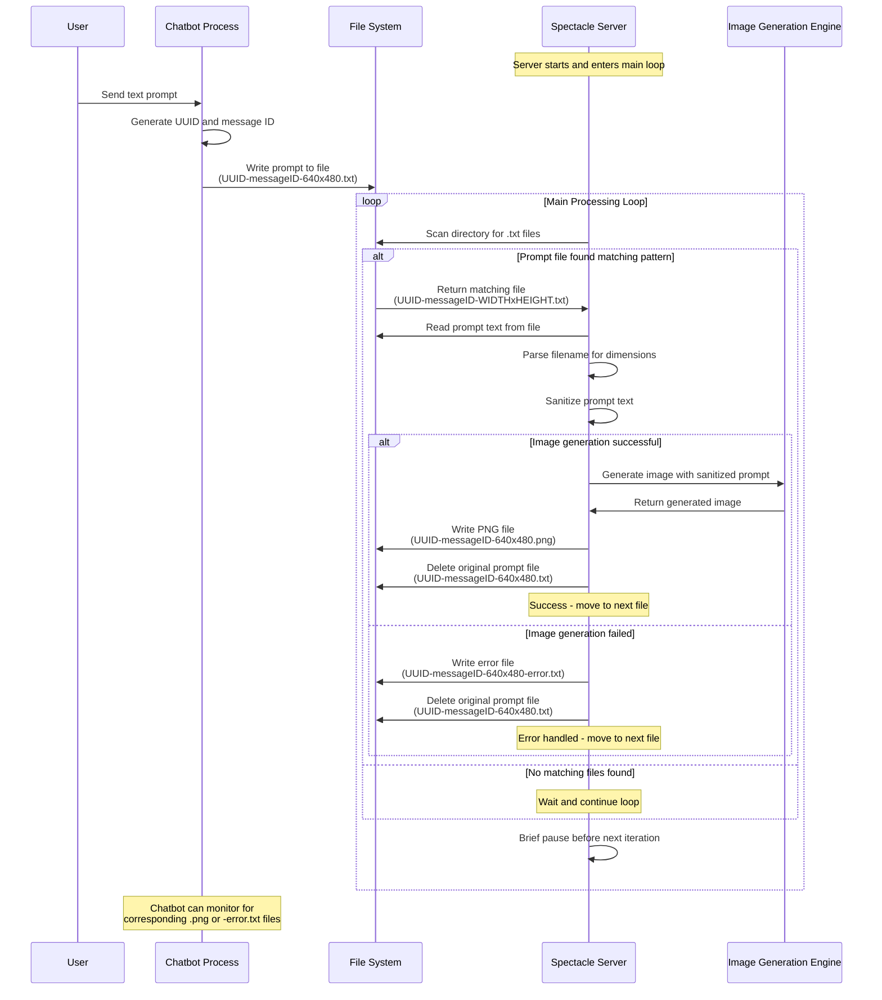

## Spectacle

An image generator server that calls an AI model to generate an image from a text prompt (T2I).

### How the Server Works



Users will send a text prompt to a different process, such as a chatbot, on the same machine where Spectacle server runs. The chatbot process will write the prompt into a text file on the filesystem for Spectacle to find, and generate an image from that prompt. Spectacle runs in a loop, looks at files in a specified (configured) directory such as "spectacle-server", looking for prompt files from the chatbot process.  The filenames will contain the user's UUID then a dash then a message ID then a dash then the image dimensions with a lowercase x separating the number of pixels (like "640x480") and the extension of this file will be ".txt" because the file will contain the text prompt only. The text may or may not be sanitized, and it's the job of Spectacle to sanitize it enough to use it. Any files Spectacle finds in the directory not matching this naming convention will be ignored. The resulting image from that prompt needs to be stored in the same directory with the same name, but with a ".png" file extension because the file will contain the PNG formatted resulting image as a response. If there was any error, and no image was produced, there should be a resulting error file with the same file name as the prompt file had, but with "-error" at the end, just before the ".txt" extension. The python script must delete the prompt file once either an image file has been successfully written, or an error file has. The python script should loop and generate one image or error response at a time, and then move on to finding the next prompt file.

Goals of this filesystem interface design include:
- The filesystem can be the interface between processes written in different programming languages, and is handy for watching and potentially debugging communications between the client process(es) and Spectacle.
- This design keeps the communication very simple between the two processes.
- It is even possible to run these processes on separate machines, if you'd like to, by using a network filesystem. Mounting the directory on multiple Spectacle image generator server machines isn't supported yet because each instance of Spectacle has no way of knowing if a different instance of Spectacle is already performing the work of generating the image. The way to solve this is to provide a filesystem hint that one of the machines began generating the image, but I didn't implement this yet because I don't currently run more than one Spectacle server.

### First Working Version

This first working version uses the [Qwen-Image](https://huggingface.co/Qwen/Qwen-Image) model for Text to Image generation.

TODO: Plug in more image generators and revise the code to make it switchable between generators.

#### System Requirements for Qwen-Image

It appears that Qwen-Image must allocate around 23GB of RAM in order to begin processing, but then uses under 5GB during generation (using my settings and code below). I tried to run it on a machine with these specs:

- AMD Ryzen 9750X with 16 cores
- 64GB DDR5 system RAM
- 1x Nvidia 3080 GPU with 10GB VRAM
- Fedora Linux with 25GB total swap space

It runs on CPU-only because the system has enough RAM available to allocate everything and run. But, there appears to be no usable configuration for running it on the 3080 GPU because it has only 10GB of VRAM and Qwen-Image then cannot allocate the ~23GB of space it needs to allocate, so GPU doesn't work at all! I tried several configurations and code changes that are supposed to make it work and all they do is allocate all the system RAM until it't all allocated, then allocates all of the swap space until the system freezes. But CPU-only works fine, and renders an image in about 2 minutes and 30 seconds.

Note also that once you pull all of the requirements (libraries and models) required for running Qwen-Image, the total disk space required is on the order of 100 Gigabytes of storage.

#### Installation

You must first install the NVIDIA cuda library.

The below installation instructions should work on Fedora 42 assuming you have NVIDIA proprietary drivers and CUDA 12.x+ installed via:

     # dnf install akmod-nvidia cuda --allowerasing

You must install the python conda utility because Qwen-Image and the required set of libraries requires a specific version of python (3.10) in order for everything to install and work without issues.

     # pip install conda

Begin the conda Python 3.10 environment inside the "spectacle" source directory:

     # git clone git@github.com:yavin5/spectacle.git
     # cd spectacle
     # conda create -n spectacle python=3.10
     # conda activate spectacle

Install dependencies:

     # pip install git+https://github.com/huggingface/diffusers
     # pip install torch
     # pip install accelerate
     # pip install transformers

If you want to try the faster Qwen Image Lightning model, install this also:

     # pip install peft --upgrade

You can run it in the foreground like this (but don't run it yet):

     # python3 spectacle_server.py

On the first run it will download around 70GB worth of files, including the Qwen-Image model files, and other heavy binaries that are required to run the transformers. Run it when you know for you have more than enough disk space still free, and when you know you have the network capability of downloading that size of binary files.

If you run the download more than once, interrupting it part way through, you may get stuck with unfinished cached files that only stay there and don't get cleaned up, and take up a lot of disk space. Remove them like this:

      # rm -rf ~/.cache/huggingface/hub/models--Qwen--Qwen-Image

Once the program runs all the way through without any issues, and has downloaded everything it needs to generate images, then you should tell the HuggingFace library to go offline, or else it may keep attempting to download files it already has for >20 minutes every time the program starts!

Edit the spectacle_server.py file and change this line, near the top:

```python
os.environ['HF_HUB_OFFLINE'] = '0'
```

Set the value to a '1'. That makes Huggingface Hub go offline so it doesn't delay, attempting to download things it already has.

After that it may take only around 3 minutes to generate an image with the above settings on the aformentioned hardware. It tends to use only around 5GB of system RAM.

#### Tuning

To make a clearer / sharper image, change:

num_inference_steps=6

to a higher number, such as 8. Lower makes lower quality images, spending less time on quality.

To make different resolutions of images, use a different aspect ratio:

width, height = aspect_ratios["1:1"]

such as "16:9" or add/modify the resolutions in the aspect_ratios dictionary.

#### Links

Qwen-Image: Text to Image or Image to Image AI Generation
https://huggingface.co/Qwen/Qwen-Image

ModelTC / Qwen-Image-Lightning: Speed up Qwen-Image model with distillation
https://github.com/ModelTC/Qwen-Image-Lightning

Eddie: Signal messenger AI bot with group channel support, tool calling, and image generation, written in pure Typescript, MIT license.
https://github.com/yavin5/eddie
